# 無限期停工

  
  

<!---
rin4096/rin4096 is a ✨ special ✨ repository because its `README.md` (this file) appears on your GitHub profile.
You can click the Preview link to take a look at your changes.
--->
